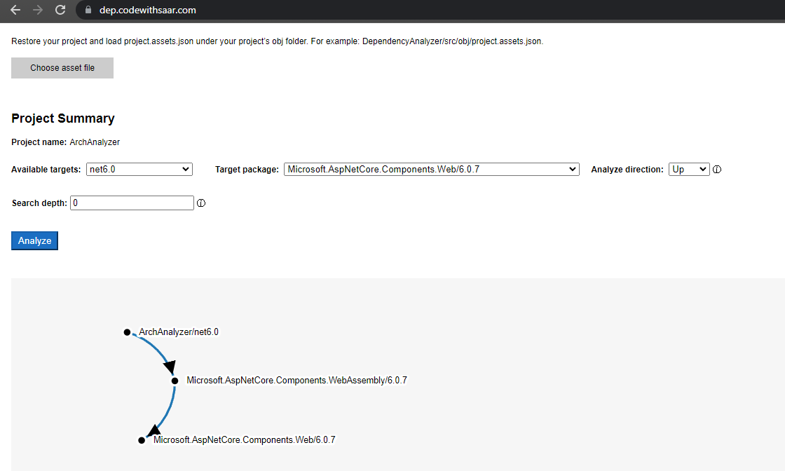
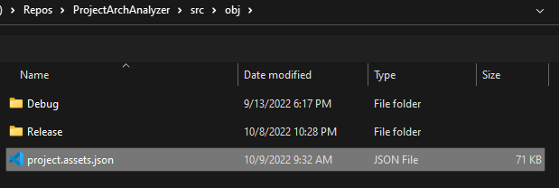

# .NET Project Dependency Analyzer

Visualize .NET project dependencies.

## The problem

It is not always clear which package or packages on the chain bring in a dated package. A visualizer helps find it. For example, assuming `Microsoft.AspNetCore.Components.Web/6.0.7` is out of compliance, you want to find out what projects/packages currently depend on it:

## Get started

1. Build your .NET projects.
1. Go to <https://dep.codewithsaar.com>, and click `Choose asset file` button.
1. Locate `projects.assets.json` under `obj` folder:

    

1. Select `Target package` of `Microsoft.AspNetCore.Components.Web/6.0.7` from the drop-down and with the direction of `Up`, and the search depth to 0 (unlimited).
    * So that the search starts at the target package, looking for all upstream packages to the root.

And check out the result in the graph area. In this instance:
    
`ArchAnalyzer/net6.0` depends on `Microsoft.AspNetCore.Components.WebAssembly/6.0.7`, which depends on `Microsoft.AspNetCore.Components.Web/6.0.7`.
